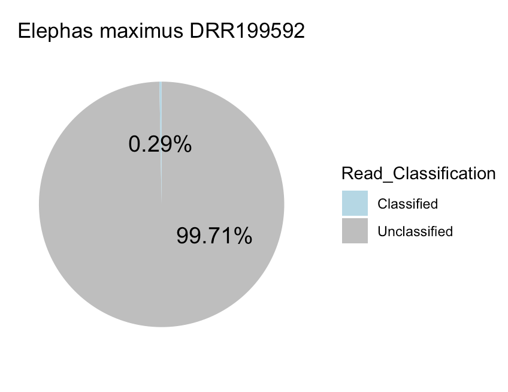
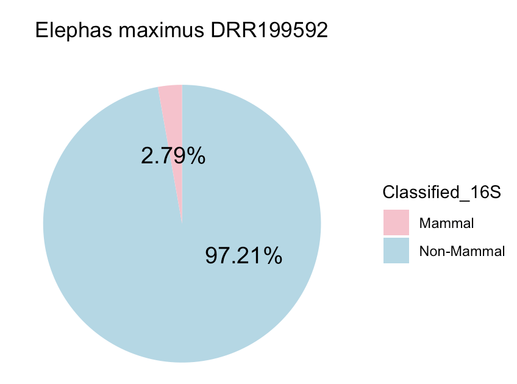

# **Workflow**

## **Introduction**

This workflow is designed to accession Sequence Read Archives (SRAs) of target species from target studies on NCBI, then run the SRAs through Derrick Wood's [Kraken2](https://github.com/DerrickWood/kraken2.git), which is a taxonomic sequence classifier that assigns taxonomic labels to DNA sequences. The goal of this workflow is to 
identify potential biological contaminants in SRAs. For more information on Kraken2, visit the [Kraken2 Manual](docs/MANUAL.markdown).

It is important to not that this is designed to function on the AMNH's Huxley Computational Cluster. Buyer beware!

## **Sourcing SRAs**

To find a project with the SRAs of the desired species:
1. Search the genus on [BioProject](https://www.ncbi.nlm.nih.gov/bioproject?cmd=Retrieve&dopt=Overview&list_uids=192.) 
2. Open up the project page and Google it (or any citations listed) to try to find the original citation it is paired with. 

To get a list of SRA accessions:
1. If the year is correct, click on its SRA experiments (should be under 'Number of Links')
2. Click Send results to Run selector 
3. Under Download, click Accession List. This will send all the SRAs associated with the BioProject to a .txt file
4. Upload the .txt file to the computational server in an accessible location

## **Kraken2**

Installing Kraken2
```
conda create -n xx #create a conda environment, replace xx with name
conda install bioconda::kraken2
```

Building a Kraken database
```
cd /path/to/where/you/want/kraken/database
kraken2-build --db Silva --special silva --clean  #use --clean to save lots of storage
```
### **Ok, let's use Kraken now**
**Prefetch command**: this command takes the path to all of the SRA files and preps the SRAs for running with Kraken2.
- Written by M. Forcellati, adapted by J. Hoffman

```
# Accession all of the SRA files
user="" #add your user. Ex: user="jhoffman1"
ID="" #add your accession ID
downloaddir=/nas4/$user/CG1/raw_reads/

# List of every pair-end read file on NCBI SRA referred to mammoth genus
filelist=/nas4/$user/CG1/scripts/$ID.txt

# Change number for every "chunk" of sample analyzed
	#replace x with number of samples
for sample in {1..x};
do
        specimen=$(sed "${sample}q;d" $filelist | awk '{print $1 }')
        mkdir -p $downloaddir/${specimen}

        cd $downloaddir

        prefetch $specimen --output-directory $downloaddir
done

```

**Full Pipeline**: this is the pipeline for running Kraken2 on the SRAs
- Written by M. Forcellati, adapted by J. Hoffman

```
#!/bin/bash
#PBS -q batch
#PBS -S /bin/bash
#PBS -l ncpus=24
#PBS -l mem=100G
#PBS -l walltime=20:00:00
#PBS -o /nas4/jhoffman1/CG1/outerr/fullpipeline.out
#PBS -e /nas4/jhoffman1/CG1/outerr/fullpipeline.err

######################
# Run full pipeline. #
######################


##############
# Initialize #
##############
#enter your user. Ex: "jhoffman1"
user="jhoffman1"
specimen="DRR199592"

echo $specimen

#activate conda -- use meghan's because she has an older version of SRA tools 
source ~/.bash_profile
conda activate /nas4/mforcellati/miniconda3/envs/CG2

# List of files is necessary for the interactive job sample specificity
	#replace with directory to your filelist
filelist=/nas4/$user/CG1/scripts/${specimen}.txt

# Directory for outputting trimmed reads [ temporary ]
	#change to your output directory
OutputDirTrim=/nas4/$user/CG1/trimmed_reads

# Source of Prefetched reads
	#change directory for the output from the PrefetchCommand.sh 
DataDir=/nas4/$user/CG1/raw_reads

#Database path - Path to the Kraken Database
DATABASE=/nas5/mforcellati/CG1/kraken/silva

# kraken out
	#change to your own output 
OUTDIR=/nas4/$user/CG1/analysis/kraken_run

# final kraken out - change to project folder when done
	#change this to your project folder (the SRA you're working on)
FINALOUT=/nas4/$user/CG1/results/$specimen

##############################
# fasterqdump and TrimGalore #

        # Run fasterqdump to get full SRA
        fasterq-dump $DataDir/$specimen

        # Make an output directory
         mkdir -p $OutputDirTrim/$specimen

        # Run trimming
          trim_galore --quality 20 --paired --retain_unpaired --gzip *_1* *_2* --output_dir $OutputDirTrim/$specimen

##########
# kraken #
##########

mkdir -p $OUTDIR/$specimen

cd $OutputDirTrim/$specimen

kraken2 --db $DATABASE  --threads 24 --output $OUTDIR/$specimen/${specimen}.out.txt  --report-minimizer-data --use-names --paired --gzip-compressed --classified-out $OUTDIR/$specimen/${specimen}#.fq *_val_1.fq.gz *_val_2.fq.gz

# Output final file
cp $OUTDIR/$specimen/${specimen}.classified.out.txt ${FINALOUT}/${specimen}.classified.out.txt

cp $OUTDIR/$specimen/${specimen}.out.txt ${FINALOUT}/${specimen}.out.txt


# Clean up - run once this code actually works.
rm -rif $DataDir/$specimen
rm -rif $OutputDirTrim/$specimen
rm -rif $TRIMDIR/${specimen}
rm -rif $OUTDIR/${specimen}

~
```

## **Final Analysis**

In order to have an interpretable outcome, we are calculating the amount of mammalian DNA vs everythign else. I know, not super specific, but it's a class project...what else can you do.

```
#PBS -q batch
#PBS -S /bin/bash
#PBS -l ncpus=24
#PBS -l mem=32G
#PBS -l walltime=20:00:00
#PBS -o /nas5/mforcellati/CG1/outerr/final.out
#PBS -e /nas5/mforcellati/CG1/outerr/final.err

# Note: Change 6 to number of projects

######################
# Run full pipeline. #
######################

# INFO - This script uses regex and wc -l on the final classified output of each analysis to provide two important metrics. One is % unclassified vs classified per analysis. Second is the proportion, within classified results, of reads mapping to given kingdom.

##############


########################
# Variable Definitions #
########################

# OUT: Project, N, Unclassified, Total, N_Mammalia_or_Mitochondria
finalout=/nas5/$user/CG1/results/finalResults/mammoth_stats.csv
cd /nas5/$user/CG1/results
projectlist=/nas5/$user/CG1/scripts/final_analysis_dir/projectlist.txt
### Put in for loop ###

for pro in {1..6};
do


project=$(sed "${pro}q;d" $projectlist | awk '{print $1 }')
projectdir=/nas5/$user/CG1/results/${project}

cd $projectdir 

N_samples=$(ls -l | tail -n+2 | wc -l)

N_reads_Unclassified=$(grep 'unclassified' * | wc -l)
N_reads_Classified=$(grep -v 'unclassified' * | wc -l)
N_reads_total=$(cat * | wc -l)
N_classified_Mammalia_Mitochondria=$( grep -v 'unclassified' * | grep -e 'Mammalia' -e 'Mitochondria' | wc -l)

echo "$project,$N_samples,$N_reads_Unclassified,$N_reads_Classified,$N_reads_total,$N_classified_Mammalia_Mitochondria" >> $finalout

done
```

## **Visualizing with Piecharts**

Ok fine you sickos, we can use R now. 

This is a basic code that relies on ggplot2 to plot a piechart of the percentages of non-mammalian results and mammalian results, as well as non-classified to classified reads

```
library(ggplot2)
library(scales)

species <- "" #insert species
project <- "" #insert project number

reads_classified <- #insert number of classified reads
reads_unclassified <- #insert number of classified reads
reads_classified_mammal <- #insert number of classified mammal reads

NM <- reads_classified-reads_classified_mammal #computes non-mammal classified 
M <- reads_classified_mammal #straightforward and probably unnecessary. 
tr <- reads_classified+reads_unclassified #total reads

title=paste0(species, " ", project)

#create a data frame
df1 <- data.frame(
  Classified_16S = c("Non-Mammal", "Mammal"),
  value = c(NM, M)
)

df2 <- data.frame(
  Read_Classification = c("Unclassified", "Classified"),
  value = c(reads_unclassified, reads_classified)
)

#create a stacked barchart
bp1<- ggplot(df1, aes(x="", y=value, fill=Classified_16S))+
  geom_bar(width = 1, stat = "identity")

bp2<- ggplot(df2, aes(x="", y=value, fill=Read_Classification))+
  geom_bar(width = 1, stat = "identity")

#now a piechart
pie1 <- bp1 + coord_polar("y", start=0)

pie2 <- bp2 + coord_polar("y", start=0)

#custom piechart aesthetics 
blank_theme <- theme_minimal()+
  theme(
    axis.title.x = element_blank(),
    axis.title.y = element_blank(),
    panel.border = element_blank(),
    panel.grid=element_blank(),
    axis.ticks = element_blank(),
    plot.title=element_text()
  )

pie1 + scale_fill_manual(values=c("pink", "lightblue")) +  blank_theme +
  theme(axis.text.x=element_blank(), plot.title=element_text(hjust=0.5)) +
  geom_text(aes(y = value/3 + c(0, cumsum(value)[-length(value)]), 
                label = percent(value/reads_classified, accuracy = 0.01)), size=5) + ggtitle(title)

pie2 + scale_fill_manual(values=c("lightblue", "grey")) +  blank_theme +
  theme(axis.text.x=element_blank(), plot.title=element_text(hjust=0.5)) +
  geom_text(aes(y = value/3 + c(0, cumsum(value)[-length(value)]), 
                label = percent(value/tr, accuracy = 0.01)), size=5) + ggtitle(title)
```

Wahoo! You should have plots that look like so:



Three gold stars if you made it this far.
